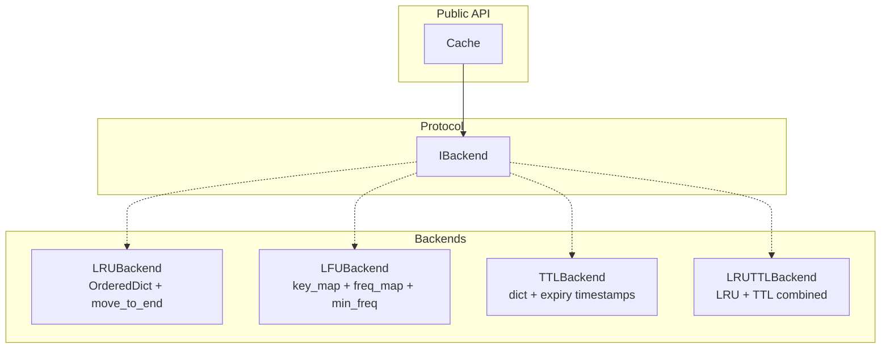

# Architecture

`purecache` follows the same **Strategy pattern** used throughout the `pure-python-system-design` project: a thin `Cache` facade manages the public API, while all storage and eviction logic lives in a pluggable `IBackend`.

## Component Overview



## IBackend Protocol

All backends implement the same protocol:

```python
class IBackend(Protocol):
    async def get(self, key: str) -> object | None: ...
    async def set(self, key: str, value: object) -> None: ...
    async def delete(self, key: str) -> None: ...
    async def clear(self) -> None: ...
```

This means swapping backends requires changing exactly one line:

```python
# Development — unbounded TTL
cache = Cache(backend=TTLBackend(ttl=60))

# Production — bounded LRU+TTL
cache = Cache(backend=LRUTTLBackend(capacity=1000, ttl=300))
```

## Concurrency Model

Each backend holds a single `asyncio.Lock`. All mutating operations (`set`, `delete`, `clear`) acquire the lock for their duration. `get` also acquires the lock because LRU and LFU backends mutate internal order on every read.

Since all operations are pure in-memory with no I/O, lock hold time is microseconds. In practice, this is never the bottleneck.

## Key Design Decisions

**Why a `Cache` wrapper and not just the backend directly?**

The `Cache` class is the extension point — it's where you'd add metrics, logging, namespacing, or serialisation hooks without touching backend logic. Backends stay focused on eviction.

**Why lazy TTL expiry?**

Lazy expiry (check on access) keeps the implementation simple and avoids a background coroutine. The trade-off is that expired entries occupy memory until accessed. For most workloads this is acceptable; for memory-sensitive environments, call `backend.purge()` periodically or use `LRUTTLBackend` where LRU pressure naturally cleans out stale entries.

**Why `asyncio.Lock` instead of per-key locking?**

A single lock is simpler and correct. Per-key locking would allow higher concurrency but introduces complexity: you need a lock registry, lock cleanup, and careful ordering to avoid deadlocks. For an in-memory cache the single-lock overhead is negligible.
