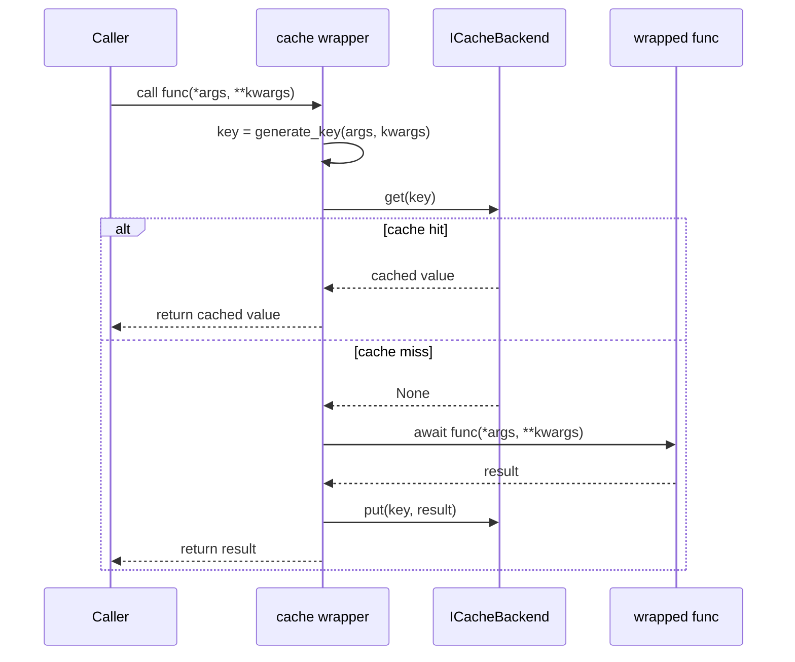

# `cache` Decorator

The `cache` decorator wraps any async function and transparently caches its return value using any `ICacheBackend`-compliant backend.

## Signature

```python
def cache(
    func: Callable,
    backend: Callable[..., ICacheBackend],
    **kwargs: Any,
) -> Callable
```

## How It Works



## Key Generation

Cache keys are derived from the function's arguments using `pickle` + SHA-256:

```python
def generate_key(args: tuple, kwargs: dict) -> str:
    canonical = (args, tuple(sorted(kwargs.items())))
    raw = pickle.dumps(canonical, protocol=pickle.HIGHEST_PROTOCOL)
    return hashlib.sha256(raw).hexdigest()
```

Two design decisions worth noting:

- **Keyword args are sorted** — `f(a=1, b=2)` and `f(b=2, a=1)` produce the same key
- **Pickle serialisation** — any picklable argument type works out of the box; non-picklable args (lambdas, file handles) will raise at call time

## Usage

```python
from aio_cache.decorators import cache
from aio_cache.backends.lru import LRUCache

@cache(backend=LRUCache, capacity=128)
async def get_user(user_id: str) -> dict:
    return await db.fetch_user(user_id)

# Cache miss — executes get_user, stores result
user = await get_user("42")

# Cache hit — returns stored result, skips get_user
user = await get_user("42")

# Different args → different key → cache miss
user = await get_user("99")
```

## Swapping Backends

The backend is injected at decoration time. Swap without touching the function:

```python
from aio_cache.backends.lru import LRUCache
from aio_cache.backends.ttl import TTLCache

# LRU eviction
@cache(backend=LRUCache, capacity=256)
async def get_product(product_id: str): ...

# TTL expiry
@cache(backend=TTLCache, ttl=60)
async def get_session(token: str): ...
```

## Known Limitations

**Caching `None` values**

The cache hit check is `if cached_res is not None`. This means a function that legitimately returns `None` will never have its result cached — every call will be a miss.

Workaround: wrap the return value in a container, or add a sentinel value to the backend protocol:

```python
_MISSING = object()

async def get(self, key: str) -> Any:
    return self.container.get(key, _MISSING)

# In wrapper:
cached_res = await cache_backend.get(key)
if cached_res is not _MISSING:
    return cached_res
```

**No cache invalidation API**

The decorator creates and owns the backend instance internally — there's no handle to call `invalidate(key)` from outside. For use cases requiring manual invalidation, create the backend instance explicitly and pass it in.

**Non-picklable arguments**

Arguments that can't be pickled (lambdas, generators, open file handles) will raise `PicklingError` at call time. Use a custom `generate_key` implementation for such cases.
