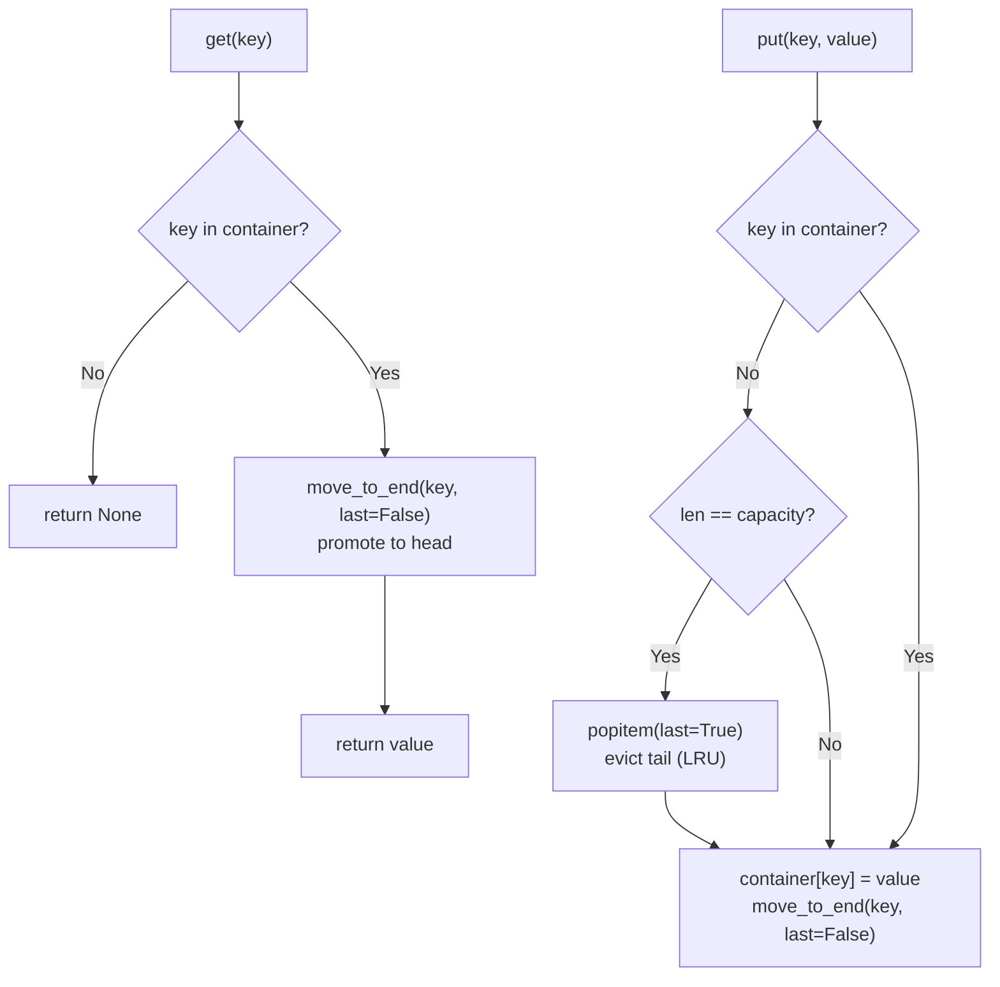

# LRU Cache

Least Recently Used eviction — when the cache is full, the entry that hasn't been accessed for the longest time is evicted first.

Implemented using `collections.OrderedDict`, which tracks insertion order and exposes two O(1) operations that make LRU trivial:

- `move_to_end(key, last=False)` — moves an entry to the front (most recently used position)
- `popitem(last=True)` — removes and returns the entry at the back (least recently used)

## How It Works



**Convention:** most recently used entries live at the **head** (`last=False`), least recently used at the **tail** (`last=True`). Eviction always removes from the tail.

## Implementation

```python
class LRUCache:
    def __init__(self, capacity: int):
        self._capacity = capacity
        self.container: OrderedDict[str, Any] = OrderedDict()
        self._lock = asyncio.Lock()

    async def get(self, key: str) -> Any | None:
        async with self._lock:
            if key in self.container:
                self.container.move_to_end(key, False)  # promote to head
                return self.container.get(key)
        return None

    async def put(self, key: str, value: Any) -> None:
        async with self._lock:
            if (key not in self.container) and (len(self.container) == self._capacity):
                self.container.popitem(last=True)  # evict LRU (tail)
            self.container[key] = value
            self.container.move_to_end(key, False)  # move to head
```

Note that `get` also acquires the lock — because promoting the accessed key to the head is a mutation of the `OrderedDict`.

## Parameters

| Name       | Type  | Description                          |
| ---------- | ----- | ------------------------------------ |
| `capacity` | `int` | Maximum number of entries. Required. |

## Usage

```python
from aio_cache.backends.lru import LRUCache

cache = LRUCache(capacity=3)

await cache.put("a", 1)
await cache.put("b", 2)
await cache.put("c", 3)

await cache.get("a")     # promotes "a" to head; order: a → c → b
await cache.put("d", 4)  # evicts "b" (LRU tail)

assert await cache.get("b") is None   # evicted
assert await cache.get("a") == 1      # still present
```

## Via Decorator

```python
from aio_cache.decorators import cache
from aio_cache.backends.lru import LRUCache

@cache(backend=LRUCache, capacity=256)
async def fetch_user(user_id: str) -> dict:
    return await db.query(user_id)
```

## Trade-offs

**Pros:**

- O(1) get and put — `OrderedDict` operations are constant time
- Excellent temporal locality — recently accessed entries stay warm
- Simple, auditable implementation

**Cons:**

- Access-frequency blind — a one-time sequential scan evicts heavily-used entries
- No time-based expiry — stale entries persist until evicted by capacity pressure

## Academic Reference

The LRU algorithm's theoretical properties are established in:

> R. L. Mattson, J. Gecsei, D. R. Slutz, I. L. Traiger.
> *Evaluation Techniques for Storage Hierarchies.*
> IBM Systems Journal, 9(2):78–117, 1970.
> https://dl.acm.org/doi/10.1147/sj.92.0078

[View Source on GitHub](https://github.com/pure-python-system-design/aio-cache/blob/main/src/aio_cache/backends/lru.py){ .md-button }
