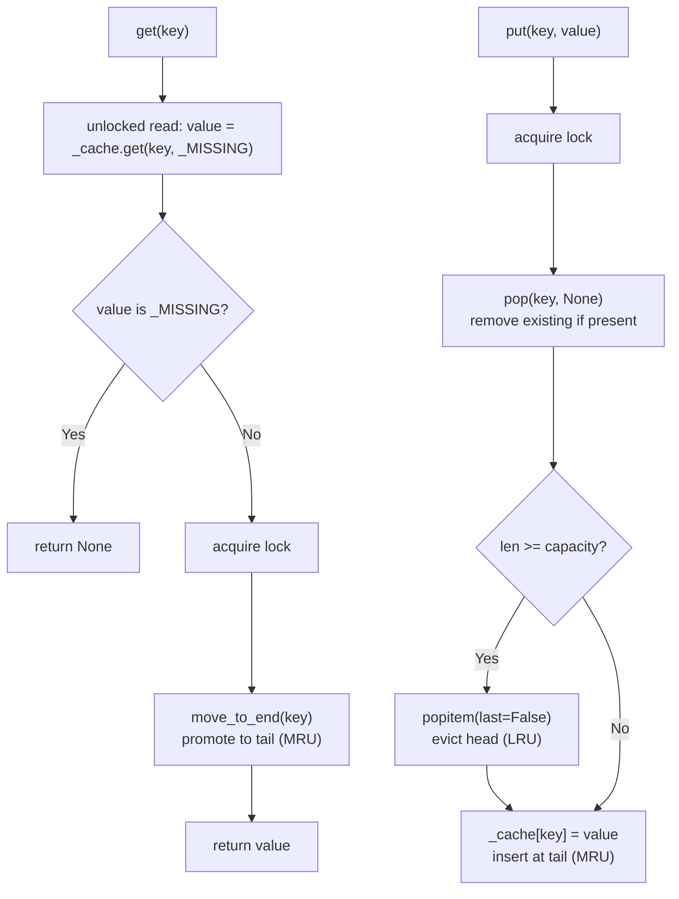

# LRU Cache

Least Recently Used eviction — when the cache is full, the entry that hasn't been accessed for the longest time is evicted first.

Implemented using `collections.OrderedDict`, which tracks insertion order and exposes O(1) operations:

- `move_to_end(key)` — moves an entry to the **tail** (most recently used position)
- `popitem(last=False)` — removes the entry at the **head** (least recently used)

## How It Works



**Convention:** most recently used entries live at the **tail**, least recently used at the **head**. Eviction always removes from the head via `popitem(last=False)`.

**Get fast path:** a cache miss is detected with an unlocked read using a `_MISSING` sentinel, so misses return immediately without acquiring the lock. The lock is only taken on a hit to promote the key to MRU. A key evicted between the read and the lock is treated as a miss (KeyError).

## Implementation

```python
class LRUCache:
    def __init__(self, capacity: int) -> None:
        if capacity < 1:
            raise ValueError(f"capacity must be >= 1, got {capacity}")
        self._capacity = capacity
        self._cache: OrderedDict[str, Any] = OrderedDict()
        self._lock = asyncio.Lock()

    def __len__(self) -> int:
        # No lock — eventually consistent
        return len(self._cache)

    async def get(self, key: str) -> Any:
        value = self._cache.get(key, _MISSING)
        if value is _MISSING:
            return None
        async with self._lock:
            try:
                self._cache.move_to_end(key)  # promote to MRU (tail)
            except KeyError:
                return None  # evicted in the meantime
        return value

    async def put(self, key: str, value: Any) -> None:
        async with self._lock:
            self._cache.pop(key, None)  # overwrite: remove existing first
            if len(self._cache) >= self._capacity:
                self._cache.popitem(last=False)  # evict LRU (head)
            self._cache[key] = value  # insert at MRU (tail)
```

Cached `None` is distinguished from a cache miss via the `_MISSING` sentinel, so `get(key)` can correctly return `None` when that value was stored with `put(key, None)`.

## Parameters

| Name       | Type  | Description                                           |
| ---------- | ----- | ----------------------------------------------------- |
| `capacity` | `int` | Maximum number of entries. Required; must be ≥ 1.     |

## Usage

```python
from purecache.backends.lru import LRUCache

cache = LRUCache(3)  # capacity must be >= 1

await cache.put("a", 1)
await cache.put("b", 2)
await cache.put("c", 3)
assert len(cache) == 3

await cache.get("a")     # promotes "a" to MRU; order (LRU→MRU): b → c → a
await cache.put("d", 4)  # evicts "b" (LRU at head)

assert await cache.get("b") is None   # evicted
assert await cache.get("a") == 1     # still present
```

## Via Decorator

```python
from purecache.decorators import cache
from purecache.backends.lru import LRUCache

@cache(backend=LRUCache, capacity=256)
async def fetch_user(user_id: str) -> dict:
    return await db.query(user_id)
```

## Trade-offs

**Pros:**

- O(1) get and put — `OrderedDict` operations are constant time
- Get fast path — misses return without acquiring the lock (unlocked read + `_MISSING` sentinel)
- `len(cache)` is O(1) and safe under asyncio (eventually consistent)
- Cached `None` is supported; miss vs stored-None distinguished via sentinel
- Excellent temporal locality — recently accessed entries stay warm
- Simple, auditable implementation

**Cons:**

- Access-frequency blind — a one-time sequential scan evicts heavily-used entries
- No time-based expiry — stale entries persist until evicted by capacity pressure

## Academic Reference

The LRU algorithm's theoretical properties are established in:

> R. L. Mattson, J. Gecsei, D. R. Slutz, I. L. Traiger.
> *Evaluation Techniques for Storage Hierarchies.*
> IBM Systems Journal, 9(2):78–117, 1970.
> https://dl.acm.org/doi/10.1147/sj.92.0078

[View Source on GitHub](https://github.com/pure-python-system-design/purecache/blob/main/src/purecache/backends/lru.py){ .md-button }
