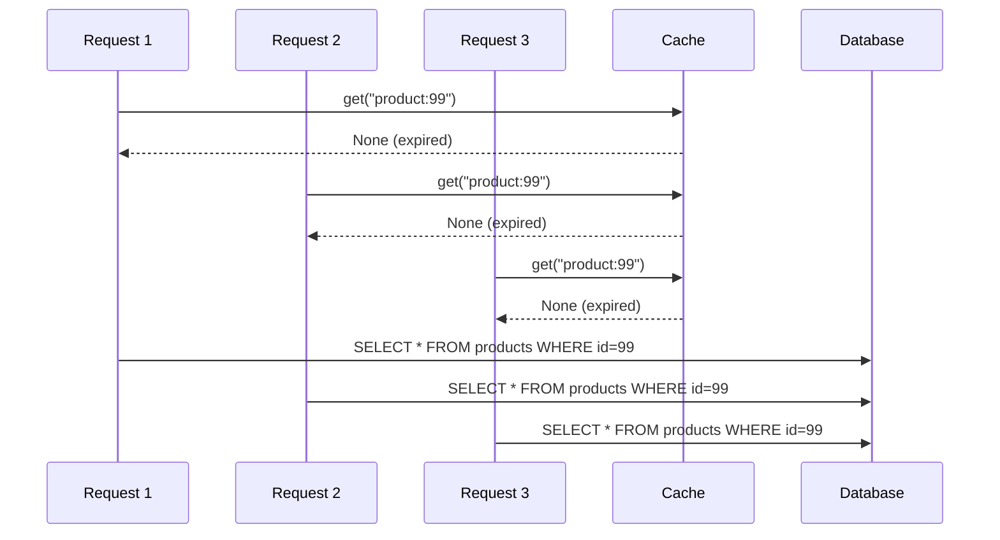

# Cache Stampede

A cache stampede (also called a "thundering herd") is what happens when a popular cache entry expires and many concurrent requests all miss simultaneously — then all race to recompute and repopulate the same value.

## The Problem



Three requests, three identical DB queries. Under high traffic, this becomes hundreds.

## The Fix: Per-Key Locking

The standard mitigation is to hold a lock per cache key during recomputation. Only the first request that misses computes the value; the rest wait and then read from cache.

```python
import asyncio
from aio_cache import Cache, LRUTTLBackend

cache = Cache(backend=LRUTTLBackend(capacity=1000, ttl=300))
_locks: dict[str, asyncio.Lock] = {}

async def get_or_compute(key: str, compute) -> object:
    # Fast path — cache hit
    value = await cache.get(key)
    if value is not None:
        return value

    # Slow path — acquire per-key lock
    if key not in _locks:
        _locks[key] = asyncio.Lock()

    async with _locks[key]:
        # Double-check after acquiring lock
        # (another coroutine may have populated it while we waited)
        value = await cache.get(key)
        if value is not None:
            return value

        value = await compute()
        await cache.set(key, value)
        return value
```

The double-check after acquiring the lock (the "check-lock-check" pattern) is essential — without it, all waiting coroutines would still recompute on lock release.

## Why This Isn't Built Into aio-cache

Stampede protection requires knowledge of your *compute* function, which is application-specific. Building it into the cache layer would either force a callback-based API (`cache.get_or_set(key, compute_fn)`) or leak application concerns into the cache.

A thin helper like `get_or_compute` above, composed around the cache, is the cleaner separation.

## Alternative: Probabilistic Early Expiry

Another approach is to refresh entries *before* they expire, probabilistically. As a TTL entry approaches expiry, occasional requests trigger background refresh while still serving the cached value. No locking required, but requires a background task and more complex TTL semantics.

This is left as an exercise.
